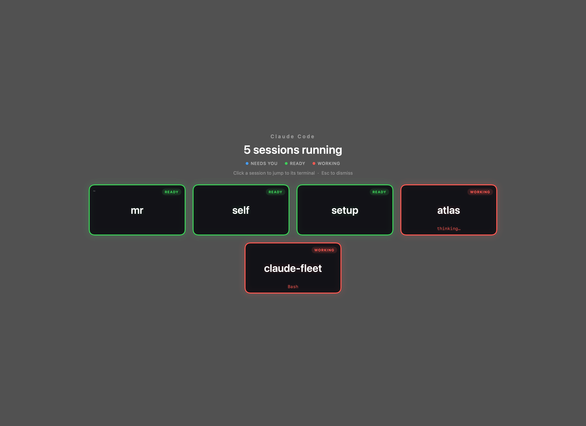

# Fleet

A macOS background app that shows you every Claude Code session on your machine the moment you
stop working — so you come back from a coffee and immediately see which sessions finished, which
are still grinding, and which are sitting there waiting for you to answer something.



Go idle for 45 seconds and a panel appears. One tile per running session, each bordered
by what it's doing:

| Border | Meaning |
|--------|---------|
| 🟩 **green** | finished its turn, ready for a new prompt |
| 🟥 **red** | a tool is running right now |
| 🟦 **blue** | blocked on you — a question or a permission approval |

A tile is deliberately close to empty: the project name, the border colour, the state, and —
only while it's working — the one step in flight. When a session has handed work to a sub-agent
there's one more line, in orange: which sub-agent, and what it's doing right now. That one is
worth its space because nothing else on the tile would move while it runs. The directory is shown only when it isn't
just the project name again. This is a thing you read in half a second from across the desk,
not a dashboard; `--scan` is there when you want the details.

Click a tile and the panel disappears, and the terminal tab running that session comes to the
front with your cursor ready to type. Press <kbd>Esc</kbd>, or click the background, to just
dismiss it.

Sessions you can type into come first — ready, then the ones blocked on a question, then the
ones still working, which need nothing from you at all.

The grid keeps two columns for as long as they fit in three rows, so up to six sessions sit in a
2 × 3 block; past that it goes to three across, and past nine it pages sideways a screenful at a
time rather than running off the bottom of the display.

And because the panel only appears when you go idle, a session that asks you something while
you're working in another window would otherwise say nothing until you happened to look — so
that one state also posts a notification. Clicking it goes straight to the terminal that asked.
Only that state: every turn of every session ends, and a banner for each would teach you to
ignore all of them.

## Opening it yourself

Waiting to go idle is the point, but not when you just want to check on things. Any of these
brings the panel up immediately:

- **<kbd>⌘</kbd><kbd>⌥</kbd><kbd>L</kbd>** — a system-wide hotkey; raises the panel from wherever
  you are. It needs no Accessibility permission, but it does need the chord to be free: if
  another app already owns it, Fleet says so in `/tmp/fleet.log` and the other two still work.
- **Spotlight** — <kbd>⌘</kbd><kbd>Space</kbd>, type `Fleet`, <kbd>↵</kbd>
- **the `fleet` command** — installed to `~/.local/bin/fleet`
- **the menu bar plane** — click it

## The menu bar

Fleet's only permanent presence is a small paper plane at the right of the menu bar. The plane
itself stays plain; a tiny dot at its tail carries the colour of the session that most wants
your attention — blue when one is waiting on an answer, green when one has finished its turn,
red when they are all still working. With nothing running there is no dot at all. A glance tells
you whether anything needs you without opening the panel.

Clicking it toggles the panel. Right-clicking gives the session count broken down by state, plus a quit item —
which unloads the LaunchAgent, since `KeepAlive` would otherwise restart Fleet a second later.
It comes back at the next login.

Spotlight and `fleet` toggle: repeating either puts the panel away. The hotkey only ever brings
it to the front, so hitting it twice is harmless — dismiss with <kbd>Esc</kbd>.

All three reach the copy that's already running rather than starting a second one, so there's
never more than one agent scanning.

## Talking to it

The panel comes up with a text field under the tiles, empty and **already holding the caret**.
No key opens it, on purpose: a key to open it is a key you'd have to press before your dictation
shortcut, and the shortcut should be the only thing you touch. Open the panel, hit your
dictation key, talk.

It is an ordinary text field and nothing else. **Fleet has no microphone**: it opens no audio
input, records nothing, starts nothing listening, and asks for no microphone or speech
permission. If you dictate, that is between you and whatever tool you dictate with — it pastes
into the focused field the same way it would into any other app, and the field cannot tell that
from typing.

**Nothing is sent until you send it.** What lands in the field is a draft: fix the word that
came out wrong, add a sentence, press <kbd>↵</kbd> to send, <kbd>⇧↵</kbd> for a second line,
<kbd>Esc</kbd> to throw it away — and <kbd>Esc</kbd> again, on an empty field, to dismiss the
panel. Whatever comes back appears on a line under the field, which never moves or disappears
while you are aiming at it. That step earns its keep with dictated text, where project
names are what gets mangled most — and the project name is the word that decides which session
your prompt lands in.

What happens next depends on what you asked for. A small model reads the sentence once and picks
one of three destinations:

- **An existing project.** "In fleet, the two self tiles are swapped" opens a terminal in
  `~/self/fleet` and starts a Claude Code session with that as its first prompt. The project is
  matched against the directories under `~/self` plus wherever your live sessions are running,
  so you can name one however you normally say it.
- **A new project.** "Start me a CLI that renames photos by their EXIF date" asks first, with the
  proposed directory name editable, then creates it and opens a session there.
- **Anything else.** A question that isn't about code is answered on the panel, rather than
  starting a session that has nowhere to go.

That decision is a model call rather than a keyword list, because keywords get it wrong in both
directions: "the thing where the tiles swap" is code work with no code words in it.

There is no API key to set up. Fleet runs `claude -p` — the same binary it spends its life
watching — so the routing goes through the Claude Code subscription already installed on the
machine rather than prepaid API credits, which are a separate bill. The cost is a couple of
seconds of process startup: about five seconds from pressing <kbd>↵</kbd> to a terminal
opening.

To see where a sentence would go without sending it:

```bash
fleet --route "the tiles in fleet are showing each other's conversations"
#   kind:    existing_project
#   project: fleet
#   prompt:  Fix the tiles showing each other's conversations
```


## When it stays out of the way

Idle time alone can't tell a finished day from a film — both are minutes without a keystroke.
So before the idle trigger fires, Fleet checks whether anything is holding the display awake:
a video playing, a presentation, a screen share. Firefox names its assertion `video-playing`,
which is as direct a statement of intent as you could ask for. If something is, the panel waits.

Only the *idle* trigger defers. The hotkey, the menu bar item and `fleet` all open the panel
mid-film, because those are you asking for it.

This is deliberately typed on **display** sleep rather than system sleep: `caffeinate`, a long
download and an overnight build all keep the machine awake with nobody looking at it, and those
are exactly the moments the panel is welcome. Audio-only playback lands the same way — the panel
is silent, so a podcast is no reason to suppress it.

`fleet --scan` says so when it is deferring:

```
idle: 34s (threshold 45s)
display held awake by "video-playing" — the idle trigger is deferred
```

## Install

```bash
git clone https://github.com/anpawo/fleet.git
cd fleet
./install.sh
```

That builds the app, installs it to `~/Applications`, registers a LaunchAgent so it starts at
every login and restarts if it ever dies, and drops a `fleet` command in `~/.local/bin`. Nothing
else to configure.

The first time you click a tile, macOS asks whether Fleet may control Terminal. Approve
it — without that permission a click can only raise the terminal app, not the specific tab.

Then, once:

```bash
fleet --install-hooks
```

That is what makes the tile colours right rather than merely likely — see below. It is also
offered from the menu bar, and undone with `fleet --uninstall-hooks`.

If you rebuild Fleet — and you will, it's yours now — run this once:

```bash
./make-signing-identity.sh
```

macOS attaches a granted permission to the app's *signing identity*. The default ad-hoc
signature has no identity: its fingerprint is a hash of the binary, so every rebuild is a new
application as far as macOS is concerned, and every permission is asked for again. The script
creates a self-signed certificate in your login keychain, trusted for code signing and nothing
else; `build.sh` uses it automatically from then on. Approve the permissions one final time
after the next build and they stick. Undo it by deleting **Fleet Self-Signed** from Keychain
Access.

Requires macOS 14+ and the Xcode Command Line Tools (`xcode-select --install`).

To remove it entirely: `./uninstall.sh`

## Battery

This runs all day, so it's built to cost as close to nothing as possible.

**It does no work when you have no sessions open.** Every 60 seconds it asks the kernel for the
process list and checks whether anything named `claude` is alive. If not, it stops there — no
file reads, no UI, no allocations. That check is a couple of syscalls.

When sessions *are* alive it refreshes the whole picture every 5 seconds, so the panel is
current the instant it opens rather than as of whenever it last appeared. That refresh is far
cheaper than it sounds: transcripts are `stat`ed and only re-parsed if their tail actually
moved, so a fleet that's sitting idle costs one `stat` per session. While the panel is on screen
the same refresh runs every second, and tiles track their sessions live.

Measured on six live sessions, several of them actively writing: about 1% of one core while
hidden. Nearly all of the remaining cost is the process scan, not the transcripts.

The specific things it refuses to do:

- **Never shells out.** No `ps`, no `lsof`, no `pgrep`. Everything comes from `libproc` and
  `sysctl` directly. Forking a process on a timer is the most expensive thing a background agent
  can do, and it's completely avoidable.
- **Never screenshots.** Capturing terminal windows would need ScreenCaptureKit, the Screen
  Recording permission, and real GPU work every refresh. Everything on a tile comes from the
  session's own JSONL transcript instead, which is cheaper to read, sharper at tile size, and
  needs no permission at all.
- **Only reads what changed.** Transcripts are `stat`ed and skipped unless their size or mtime
  moved, and only the last 256 KB is ever read cold. After that the parse *resumes*: it's a fold
  over lines whose state is kept between refreshes, so an append costs the appended bytes rather
  than a re-read of the tail.
- **Timers carry 50% tolerance**, so macOS coalesces the wakeups with other timers instead of
  waking the CPU on our behalf.
- **Stops dead on sleep.** All timers are torn down on sleep or display-off and rebuilt on wake.
- **No live blur.** The panel backdrop is a flat scrim — a full-screen material would be
  continuous GPU work on a window whose entire purpose is to save power.
- Runs as a `Background` / `LowPriorityIO` LaunchAgent, so the scheduler treats it accordingly.

While the panel is actually on screen it refreshes every 3 seconds. That's the only period where
it does meaningful work, and it ends as soon as you click.

## How it figures things out

**Finding sessions.** `proc_listpids` for the process list, matched on `proc_name`. Claude Code
now ships as a self-extracting binary whose `proc_pidpath` lookup returns nothing, so the comm
field is the reliable identifier. Working directory comes from `PROC_PIDVNODEPATHINFO`, the TTY
from `PROC_PIDTBSDINFO`, and CPU from `proc_pid_rusage` sampled across refreshes.

**Matching a session to its transcript.** Claude Code stores transcripts under
`~/.claude/projects/<mangled-cwd>/<session-id>.jsonl`, but several sessions often share one
working directory, so the directory alone is ambiguous. Resolution starts with the one source
that doesn't have to guess:

0. The state hooks below run *inside* the session — the payload names the transcript, and the
   hook process is a child of the session, so its parent pid names the process. Fleet reads the
   pair out of the state file and skips every pass below for that session. This is what survives
   `/clear` and a compaction, both of which start a **new** transcript in the same process:
   without it the binding stays on the file that was abandoned, and a conversation that ended
   reads as a session that has finished — a green tile on a session that is working.

The rest are inferences, for sessions the hooks haven't spoken for yet:

1. `claude --resume <id>` names its transcript outright — read from the process's argv via
   `KERN_PROCARGS2`.
2. Otherwise, a fresh session writes its transcript shortly after launch, so each process claims
   the unclaimed transcript created soonest *after* its own start time.
3. `claude --continue` reopens an older file, so anything left over falls back to the most
   recently modified unclaimed transcript.
4. If a session is *still* unmatched, its transcript isn't filed under its working directory at
   all — Claude Code picks the project folder once, at session start, so renaming that directory
   or `cd`ing out of it leaves the file behind under the old name. Every transcript entry stamps
   the session's current directory, so the last resort is to scan transcripts written in the
   last few minutes across all projects and take the one whose recorded cwd is this process's.
   It only runs while some session is unmatched, at most every 5 seconds.

Inferred bindings are sticky once resolved; a hook can always overrule them. A session you've launched but not yet prompted has no
transcript at all, and shows up as a ready tile with just its directory — unless it's burning
CPU, in which case that alone marks it as working.

**Deciding the colour: asking rather than guessing.** Claude Code fires hooks on the exact
transitions Fleet cares about, so it can be asked instead of read. `fleet --install-hooks` drops
a small `sh` script in `~/.claude/fleet/` and points `~/.claude/settings.json` at it: `Stop` means the turn is over (green),
`Notification` means the session is blocked on you (blue — unless the notification is the
"you've been idle a while" one, which means the opposite), and `UserPromptSubmit` and the tool
hooks mean it's working (red). Each fires once, writes
`{"state":…,"at":…,"pids":…,"transcript":…}` to `~/.claude/fleet/state/<session-id>.json` and
exits; Fleet reads that file — for the colour, and for the pairing above. Your existing hooks
and settings are kept, a copy of the file is saved beside it, and `--uninstall-hooks` takes only
Fleet's entries back out. The script is versioned: one written by an older Fleet counts as not
installed, so `fleet --scan` says so and the menu offers to update it.

That is the answer, not an estimate, and it is what fixed the failure that mattered most: a
session that had *finished* showing red. You don't go back to a red tile, so a wrong colour there
costs you a session you'd have picked up.

The inference below is still there and still runs — for sessions that started before the hooks
existed, and for the moments a hook hasn't fired yet. The two are ranked by recency, and the
hook wins a tie: a hook fires *on* the transition, so it is the better evidence for as long as
nothing has been said since, and the transcript takes over once it moves again. "Said" means the
timestamp on the last conversation entry, not the file's mtime — Claude Code appends `ai-title`
and `last-prompt` lines seconds *after* a turn ends, so the mtime of a finished session keeps
moving while nothing is happening.

**Deciding the colour without them.** The transcript is walked to find tool calls with no matching result. No
pending tool usually means the turn ended cleanly — green. The exception is the window between
you sending a prompt and Claude's first token: nothing is pending and no reply exists yet, so it
looks *exactly* like a finished turn. Who spoke last breaks that tie — a trailing user message
means the turn is still open, so it's red. Cancelling with <kbd>Esc</kbd> also appends a user
message, so that one marker is recognised and excluded, or the session would sit at red forever.
Claude Code also files hook output and cross-session messages as user entries, marked `isMeta`;
those are excluded too, or one arriving after a turn ends reopens it and paints an idle session
as a working one. A pending `AskUserQuestion` or `ExitPlanMode` is unambiguously blue.

A tool call whose result never lands would otherwise stay "in flight" forever — and in
`bypassPermissions` mode, where nothing ages into blue, that means a permanently red tile. Two
things clear them: a cancelled turn names the message it cut short, and an assistant message
with a *new* id proves every earlier call was answered, since the API won't take another turn
while a `tool_use` is outstanding. Calls issued together share an id and are left alone.

**The multiple-choice question is invisible.** `AskUserQuestion` never appears in the transcript
while it is pending: Claude Code holds that assistant message back and writes it only once you
answer, and it lands stamped with the time it was *generated*, so reading the file afterwards
makes it look like it was there all along. Live, the last thing in the file is the tool result
from the step before — a question with five options sitting on your screen and a session that
looks like it is still thinking. So the silence is the signal: an owed turn with nothing pending,
no CPU and nothing written for 25 seconds is a question, not a model composing. A genuinely long
thinking block can trip that and go blue for a moment before its next block lands; the threshold
is longer than the 12 seconds used below because there's no outstanding tool call corroborating
it, and there is no cheaper evidence to be had — a permission prompt and a question both live
entirely in the terminal until they're answered.

Anything else pending is genuinely ambiguous: "running a long command" and "showing you a
permission prompt" look *identical* in the transcript, because in both cases Claude asked to do
something and no result came back. That tie is broken on behaviour rather than content — if the
process is burning CPU or has written to its transcript in the last 12 seconds it's working
(red), otherwise it's been silent with a request outstanding, which in practice means a prompt
is on your screen (blue). Sessions in `bypassPermissions` mode can't be blocked on approval, so
they stay red.

**Sub-agents.** A session that delegates to a sub-agent is the one case where every signal above
lies. The sub-agent writes to its own transcript under `<session-id>/subagents/`, so the main
file goes silent; the tokens burn on Anthropic's machines, so the CPU goes quiet — and a session
that is very much busy looks stalled, then trips the staleness test and claims to need you.

So the sub-agents are read too. Each `agent-*.meta.json` names the `tool_use` that spawned it,
and a `Task` call still pending on the main thread is a sub-agent still working — which is what
tells a live one from the files last week's run left behind. Its own transcript then says what
it is doing this second, and the tile shows it on an orange line, with the sub-agent's own
last write standing in for the activity the main file no longer has. Sidechain entries are
still excluded from the *main* parse, so a sub-agent never produces phantom pending calls on
the thread waiting for it.

**Focusing a tab.** Every session has a distinct TTY, and both Terminal.app and iTerm2 expose a
tab's `tty` to AppleScript, so the exact tab gets selected. Raising the app is a separate step
that always works, so both are done rather than treating the script as all-or-nothing —
terminals without that scripting surface (Ghostty, kitty, WezTerm, Alacritty) simply get the
second half.

**A desktop of its own.** A session Fleet starts gets one, which is the point of starting it
from the panel: you write the sentence, and the session opens in front of you with nothing else
on screen.
macOS has no public API for creating a Space — the private one costs a partly disabled SIP — so
this is native fullscreen, which creates a desktop and switches to it, and disposes of it when
the window closes, so nothing is left behind.

Two things make that harder than it sounds, and both were silent failures rather than errors.
The window to enlarge cannot be found by asking which one has focus: if any terminal window is
already fullscreen — which is what the *previous* Fleet-started session leaves behind — that one
holds the focus, and the new session ends up sharing its desktop or getting none. So the windows
are listed before the launch and the new one is found by elimination. And the terminal cannot be
looked up by bundle identifier alone: two copies of the same terminal run more often than you
would think, they are separate processes with separate windows, and the one `NSWorkspace` lists
first owned no windows at all here while four sat in the other. Every instance is checked.

Raising the app is not the same as taking you to the window. If the terminal sits on another
desktop — or on a second display running its own Spaces, which is where this turned up —
`activate` makes it frontmost and leaves you exactly where you were, so the click looks like it
did nothing. `AXRaise` on the window is the gesture macOS honours by switching to the desktop
the window is on, so that runs after activation, once the app is frontmost and its focused
window is the one holding the tab. It needs the Accessibility grant; without it a click still
raises the app and selects the tab, it just can't cross a desktop.

The host app is found by walking the process's parent chain until something owns a GUI app. That
walk reads the process table through `sysctl(KERN_PROC_ALL)` rather than `proc_pidinfo`,
because a terminal session's ancestry runs `claude → shell → login → Terminal` and `login` is
setuid root: `proc_pidinfo` returns nothing for it to an unprivileged caller, which stopped the
walk one step short of the terminal every time. If you run two instances of the same terminal
application, AppleScript can only address one of them, so sessions in the other get the app
raised without the tab being selected.

## Checking it works

```bash
fleet --scan
```

Prints every session it can see, with the transcript it bound, the state it derived and why:

```
6 session(s):

  [READY    ] portfolio  pid=40776  tty=/dev/ttys000  cpu=0.0%
      path:  ~/self/portfolio
      topic: Améliorer fluidité et ajouter effets visuels aux projets
      file:  5f43933c-708c-494e-a199-45419b67b5c6.jsonl

  [WORKING  ] self  pid=33614  tty=/dev/ttys005  cpu=0.3%
      path:  ~/self
      topic: Build idle activity monitor for Claude Code sessions
      file:  ab445216-f7c3-4d8a-b629-4d8255d34755.jsonl
      pending: Bash
```

## Options

`fleet` with no arguments toggles the panel. Anything else is passed to the binary:

| Flag | Effect |
|------|--------|
| `--scan` | print detected sessions and exit |
| `--idle <seconds>` | override the idle threshold (default 45) |
| `--show` | toggle the panel immediately, ignoring the idle timer |
| `--demo` | same as `--show` |
| `--focus <pid>` | run just the tab-raising path for one session and report what happened |
| `--route "<sentence>"` | run one sentence through the classifier and print where it would go |
| `--render <path.png>` | draw the panel offscreen to a PNG (how the image above was made) |
| `--parse <file.jsonl>` | print what one transcript parses to — pending tools, sub-agents, preview |
| `--fake <n>` | draw a fleet of n invented sessions, with `--render` or `--demo`, to see the grid at a size you don't have running |
| `--start <dir> ["<prompt>"]` | open a session the way the panel does — new window, own desktop — without the classifier |
| `--install-hooks` | let Claude Code report each session's state to Fleet (edits `~/.claude/settings.json`, backing it up first) |
| `--uninstall-hooks` | take those hooks back out |
| `--windows [bundle-id]` | list a terminal's windows on this desktop and whether each has it to itself |

Other tunables — poll cadences, the staleness window, the CPU threshold — are all in
`Sources/Fleet/Models.swift`, deliberately in one place so the battery profile is
auditable at a glance.

## Also starting it when Claude Code launches

The LaunchAgent already keeps it running from login onward, which covers this. If you'd rather
it also self-heal whenever you start a session, add a `SessionStart` hook to
`~/.claude/settings.json`:

```json
{
  "hooks": {
    "SessionStart": [
      {
        "hooks": [
          {
            "type": "command",
            "command": "launchctl kickstart gui/$UID/com.mr.fleet"
          }
        ]
      }
    ]
  }
}
```

`kickstart` starts the agent if it's stopped and does nothing if it's already up. Don't use
`open` here — opening the bundle is the manual "show me the panel" gesture, so a hook that ran
it would put the panel on screen every time you started a session.

## License

MIT
